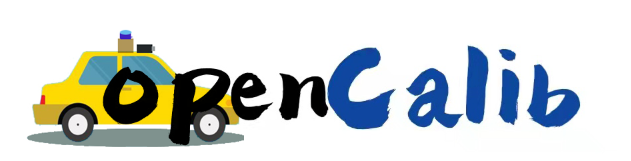

# SensorsCalibration toolbox v0.1

SensorsCalibration is a simple calibration toolbox and open source project, mainly used for sensor calibration in autonomous driving.

## Introduction

Sensor calibration is the foundation block of any autonomous system and its constituent sensors and must be performed correctly before sensor fusion may be implemented. Precise calibrations are vital for further processing steps, such as sensor fusion and implementation of algorithms for obstacle detection, localization and mapping, and control. Further, sensor fusion is one of the essential tasks in autonomous driving applications that fuses information obtained from multiple sensors to reduce the uncertainties compared to when sensors are used individually. To solve the problem of sensor calibration for autonomous vehicles, we provide a sensors calibration toolbox. The calibration toolbox can be used to calibrate sensors such as **IMU, LiDAR, Camera, and Radar**.

## Environment(Quick Start)

```shell
# pull docker image
sudo docker pull scllovewkf/opencalib:v1
# After the image is pulled down, start the docker image.  /home/sz3/ailab/ =  code root path on your host
docker run -it -v /home/sz3/ailab/:/share scllovewkf/opencalib:v1 /bin/bash
``` 

### Sensors calibration
This calibration toolbox provides some calibration tools based on road scenes. The specific contents are as follows. If you want to use one of the calibration tools in the list below, you can click the use link to enter the instruction page. 

| calibration param |calibration type| calibration method | mannual calibration | auto calibration | usage documentation |
| :--------------: |:--------------:| :------------: | :--------------: | :------------: | :------------: |
| camera intrinsice| intrinsic |  target-based  |             |  &#10004;  |[camera intrinsic](camera_intrinsic/README.md)|
| imu heading      | extrinsic |  target-less   |             |  &#10004;  |[imu heaidng](imu_heading/README.md)|
| lidar2imu        | extrinsic |  target-less   |   &#10004;  |  &#10004;  |[lidar2imu](lidar2imu/README.md)|
| lidar2camera     | extrinsic |  target-less   |   &#10004;  |  &#10004;  |[lidar2camera](lidar2camera/README.md)|
| lidar2lidar      | extrinsic |  target-less   |   &#10004;  |  &#10004;  |[lidar2lidar](lidar2lidar/README.md)|
| radar2camera     | extrinsic |  target-less   |   &#10004;  |            |[radar2camera](radar2camera/README.md)|
| radar2lidar      | extrinsic |  target-less   |   &#10004;  |            |[radar2lidar](radar2lidar/README.md)|


### Factory calibration
At the same time, the calibration toolbox also provides some factory calibration tools. 

| calibration board type  | calibration sensor | calibration board pattern | remove opencv | auto calibration | usage documentation |
| :--------------: |:--------------:| :------------: | :--------------: | :------------: | :------------: |
| chessboard        | Camera            | [chessboard ](./factory_calib/pattern/chessboard.pdf)     |       &#10004;      |  &#10004;       |[factory calib](factory_calib/README.md)|
| circle board      | Camera            | [circle_board ](./factory_calib/pattern/circle_board.pdf) |   &#10004;     |  &#10004;  |[factory calib](factory_calib/README.md)|
| vertical board    | Camera            | [vertical board ](./factory_calib/pattern/vertical_board.pdf) |   &#10004;  |  &#10004;     |[factory calib](factory_calib/README.md)| 
| apriltag board    | Camera            | [apriltag board ](./factory_calib/pattern/april_board.pdf) |   &#10004;  |  &#10004;       |[factory calib](factory_calib/README.md)|
| aruco marker board| Camera            | [aruco marker board ](./factory_calib/pattern/aruco_marker_board.pdf) |   &#10004;  |  &#10004;     |[factory calib](factory_calib/README.md)|
| round hole board  | Camera and LiDAR  | [round hole board ](./factory_calib/pattern/round_hole_board.pdf) |   &#10004;  |      &#10004;      |[factory calib](factory_calib/README.md)|
 

## Related paper 
Related paper available on arxiv:  
[OpenCalib: A Multi-sensor Calibration Toolbox for Autonomous Driving](https://arxiv.org/abs/2205.14087)

<!-- CONTRIBUTING -->
## Contributing

Contributions are what make the open source community such an amazing place to learn, inspire, and create. Any contributions you make are **greatly appreciated**.

If you have a suggestion that would make this better, please fork the repo and create a pull request. You can also simply open an issue with the tag "enhancement".
Don't forget to give the project a star! Thanks again!

1. Fork the Project
2. Create your Feature Branch (`git checkout -b feature/AmazingFeature`)
3. Commit your Changes (`git commit -m 'Add some AmazingFeature'`)
4. Push to the Branch (`git push origin feature/AmazingFeature`)
5. Open a Pull Request

<!-- CITATION -->
## Citation
If you find this project useful in your research, please consider cite:
```
@article{opencalib,
    title={OpenCalib: A Multi-sensor Calibration Toolbox for Autonomous Driving},
    author={Yan, Guohang and Liu, Zhuochun and Wang, Chengjie and Shi, Chunlei and Wei, Pengjin and Cai, Xinyu and Ma, Tao and Liu, Zhizheng and Zhong, Zebin and Liu, Yuqian and Zhao, Ming and Ma, Zheng and Li, Yikang},
    journal={arXiv preprint arXiv:2205.14087},
    year={2022},
}
```


<!-- LICENSE -->
## License

`SensorsCalibration` is released under the [Apache 2.0 license](LICENSE).


## Contact
If you have questions about this repo, please contact Yan Guohang (`yanguohang@pjlab.org.cn`).
