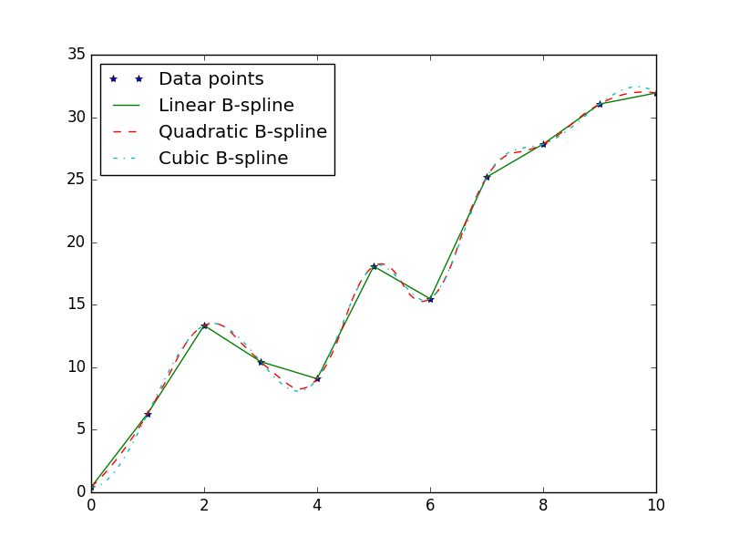

##Basic usage

The workflow to construct an approximation is simple: sample a function and construct an approximation. As the following figure illustrates, this process can be run iteratively until a satisfactory approximation has been built. To assess the accuracy of the approximation one can use existing samples for cross-validation or perform additional sampling. Note that the current version of SPLINTER only facilitates sampling and model construction. 


Figure: A possible workflow for building approximations with SPLINTER.

##B-splines
The [tensor product B-spline](http://en.wikipedia.org/wiki/B-spline) is a powerful tool for multivariable function interpolation and data smoothing. It is constructed from B-spline basis functions, which are piecewise polynomial functions with a high degree of smoothness.

The B-spline may approximate any sampled multivariate function. The user may construct a linear (degree 1), quadratic (degree 2), cubic (degree 3) or higher degree B-spline that smoothes or interpolates the data. The B-spline is constructed from the samples by solving a linear system. On a modern desktop computer the practical limit on the number of samples is about 100 000 when constructing a B-spline. This translates to a practical limit of 5-6 variables. Evaluation time, however, is independent of the number of samples due to the local support property of B-splines. That is, only samples neighbouring the evaluation point affect the B-spline value. Evaluation do however scale with the degree and number of variables of the B-spline.

The following Python example shows how to build a quadratic B-spline:
```
bspline = splinter.BSplineBuilder(x, y, degree=2).build()
```
In this example the B-spline `bspline` is built from sample points (`x`, `y`), usually assumed to lie on a regular grid. Note that SPLINTER do accept datasets of points not lying on a regular grid, but the behavior is then experimental and currently not advised.



Figure: Comparison of a linear, quadratic and cubic B-spline. The linear B-spline is continuous, the quadratic B-spline is continuously differentiable, and the cubic B-spline has a continous second order derivative.

The user may create a penalized B-spline (P-spline) that smooths the data instead of interpolating it. The construction of a P-spline is more computationally demanding than the B-spline - a large least-square problem must be solved - bringing the practical limit on the number of samples down to about 10 000. The following Python example shows the construction of a P-spline with the smoothing parameter (alpha) set to 0.1.
```
bspline = splinter.BSplineBuilder(x, y, smoothing=splinter.BSplineBuilder.Smoothing.PSPLINE, alpha=0.1).build()
```

An alternative to the P-spline, that also may reduce the variation in the B-spline is to use [Tikhonov regularization](http://en.wikipedia.org/wiki/Tikhonov_regularization). A quadratic penalty on the coefficients is then added to the OLS objective function. Regularization may be used to decrease the effect of overfitting. Currently, SPLINTER uses an identity matrix as the Tikhonov matrix. The smoothing parameter (alpha) can be set as shown in the following Python example where a cubic B-spline is built.
```
bspline = splinter.BSplineBuilder(x, y, smoothing=splinter.BSplineBuilder.Smoothing.IDENTITY, alpha=0.1).build()
```


Figure: Comparison of an interpolating B-spline, regularized B-spline, and a smoothed B-spline (P-spline). All B-splines are cubic (have basis functions of degree 3).
