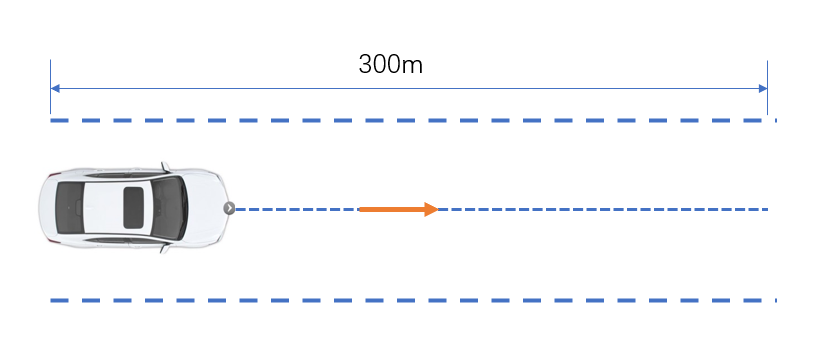
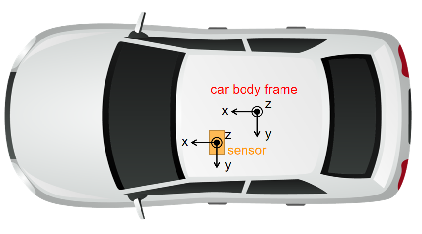

## Introduction
A project for GNSS/INS heading angle calibration.
## Environment
```shell
docker pull xiaokyan/opencalib:v1
```
## Compile
```shell
# mkdir build
mkdir -p build && cd build
# build
cmake .. && make
```
## Run example
```shell
./bin/run_imu2car ./data/example/ ./output/

# set data range(frames)
./bin/run_imu2car ./data/example/ ./output/ 0 20000
```
## Input
- <data_file>: contain GNSS/INS pose $(x, y, yaw)$
- <output_dir>: save output file
## Output
- trajectory.png: vehicle trajectory (x, y)
- compared_yaw.png: the comparison of yaw angle between imu and the vehicle, which can be used to verify the result roughly
## Note
This method can adapt to arbitrary driving routes. However, it is recommended for the vehicle to drive in a straight line for better estimation, as the picture shows below.
<div align=center></div>

The car-body frame and pose-sensor frame in this program are defined as follows:

<div align=center></div>
