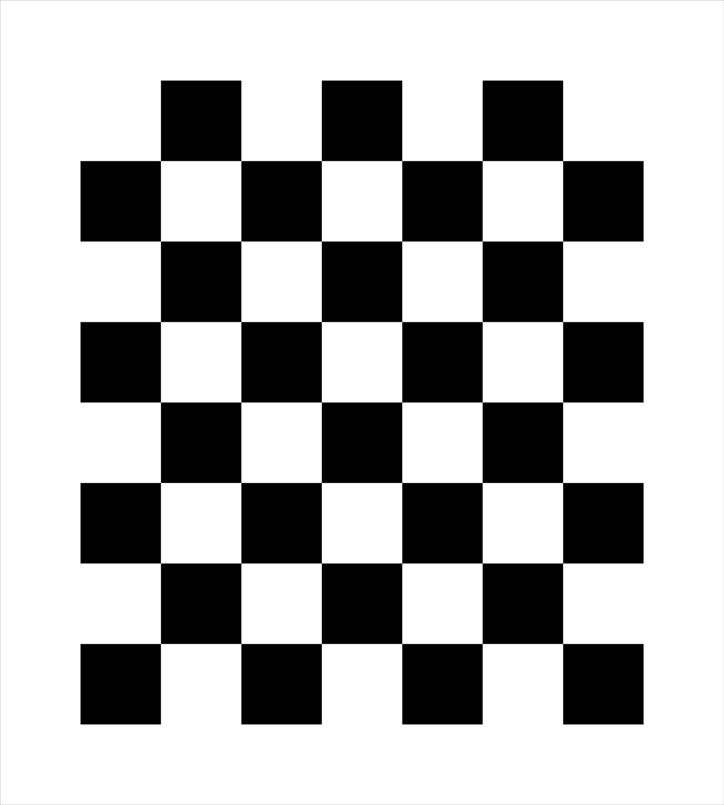
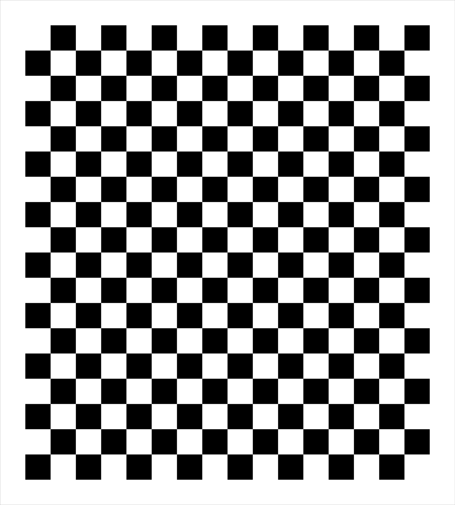

## Introduction

This is a project for intrinsic calibration and evalution.

It mainly includes two part: intrinsic calibration, distortion measurement. 

## Prerequisites

- Cmake
- opencv 2.4
- eigen 3


## Compile
Compile in their respective folders

```shell
# mkdir build
mkdir -p build && cd build
# build
cmake .. && make
```

## Input data
- <calibration_image_dir>: contains only seleted chessboard calibration image
- <distortion_image_path>: distortion harp image

## Calibration targets

Camera intrinsic calibration board, size 900 * 1000 mm, each grid size 100 * 100 mm

<br>

Camera intrinsic calibration board, size 900 * 1000 mm, each grid size 50 * 50 mm

<br>

Camera distortion measurement board, size 900 * 1000 mm

<br>
 
## Usage
1. run command:
  ```shell
  # run intrinsic calibration
  ./bin/run_intrinsic_calibration <calibration_image_dir>
  # run distortion measurement
  ./bin/run_distortion_measure <distortion_image_path>
  ```

  - **Intrinsic Calibration:** Program will automatically run intrinsic calibration. Corner-detect result will be displayed. All input calibration images will be undistorted and save to `<calibration_image_dir>/undistort/` dir.

  - **Distortion Evaluation:** Sampled points of original and undistorted images will be displayed. Undistorted distortion_image will be save to `<output_dir>`.

2. Run the test sample:
  ```shell
  # run intrinsic calibration
  cd ./intrinsic_calib/
  ./bin/run_intrinsic_calibration ./data/
  
  # run distortion measurement
  cd ./calib_verification/
  ./bin/run_distortion_measure data/test.png
  ```
## Citation
This distortion evaluation code is based on the research below:
```
@article{tang2012high,
  title={High-precision camera distortion measurements with a “calibration harp”},
  author={Tang, Zhongwei and von Gioi, Rafael Grompone and Monasse, Pascal and Morel, Jean-Michel},
  journal={JOSA A},
  volume={29},
  number={10},
  pages={2134--2143},
  year={2012},
  publisher={Optical Society of America}
}
   
```