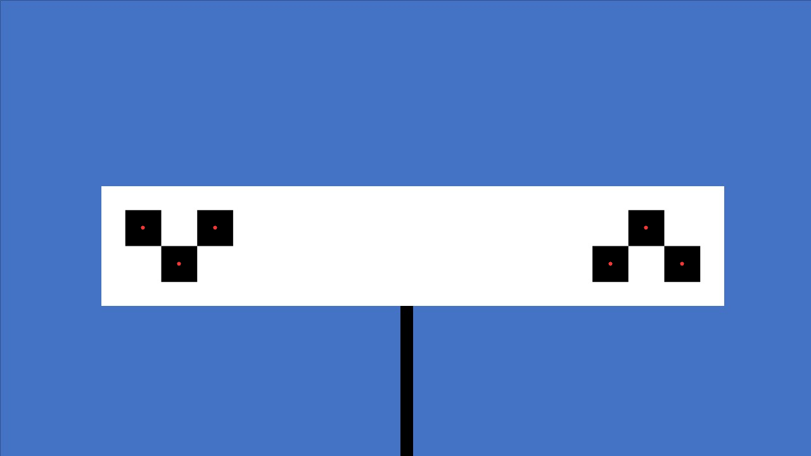
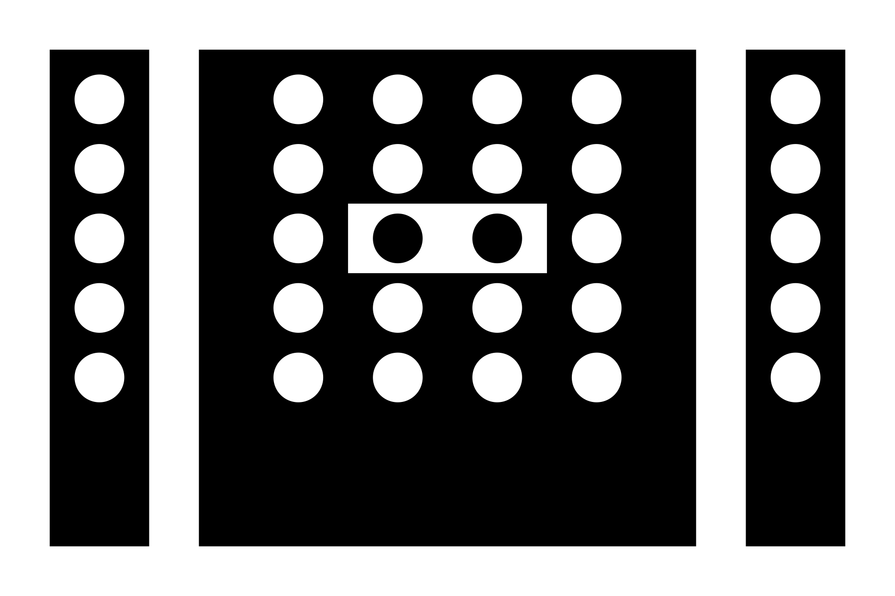
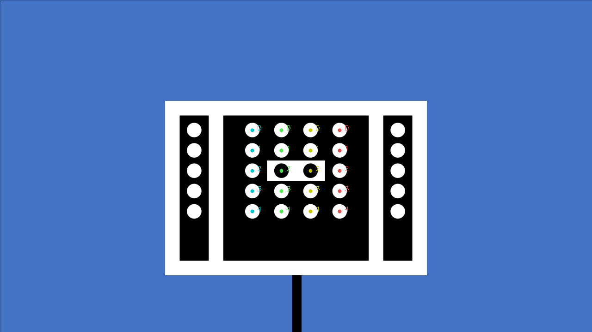
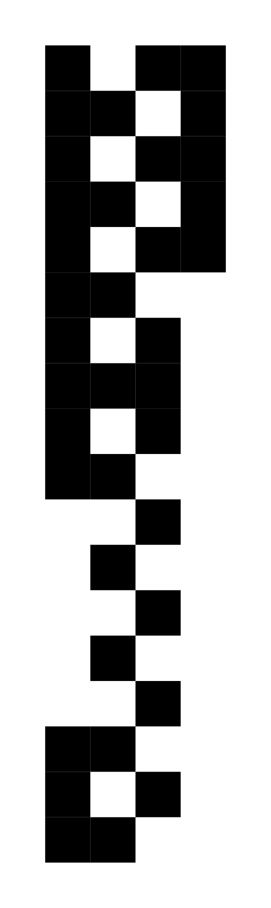
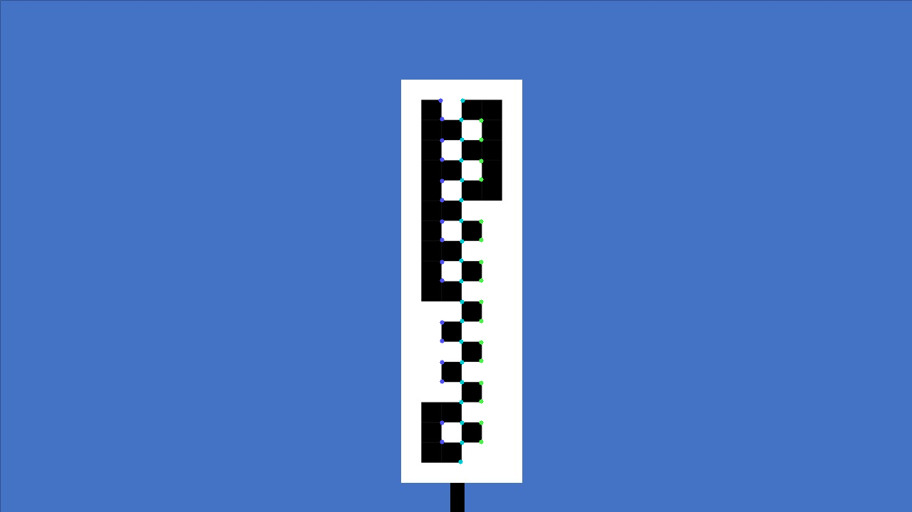
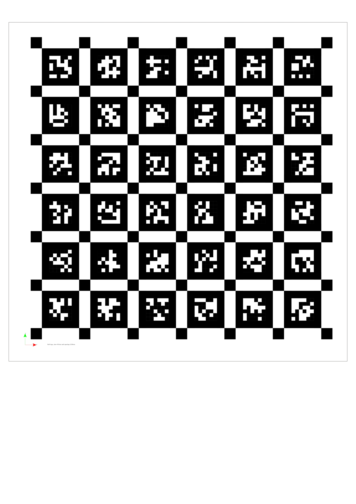
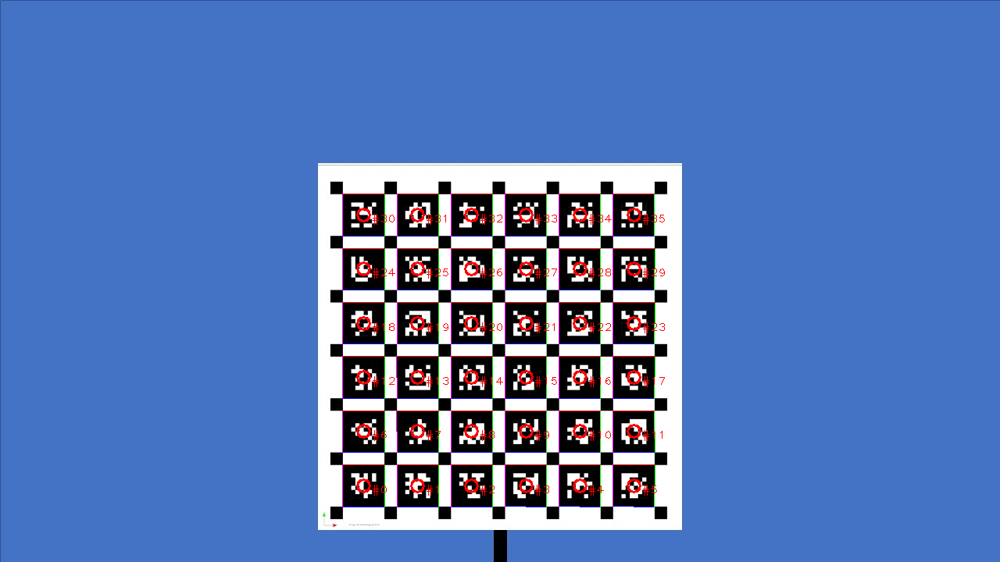
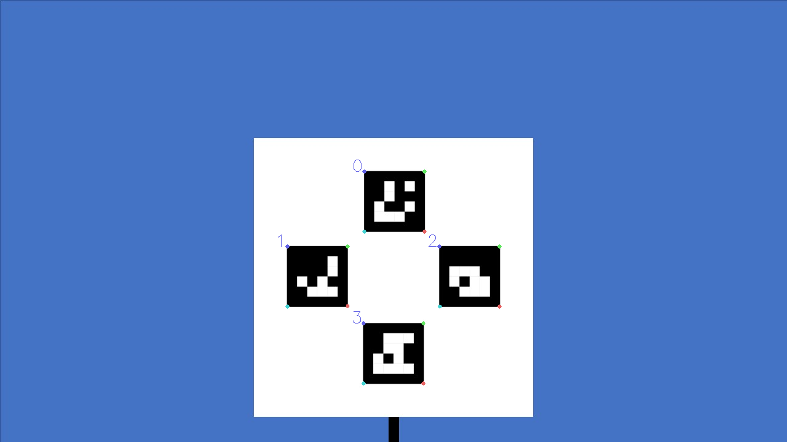
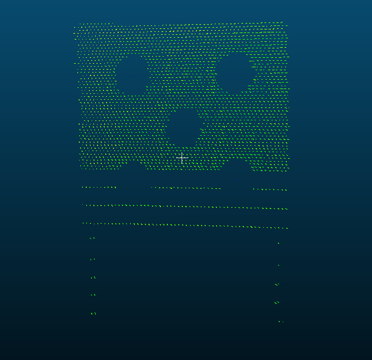
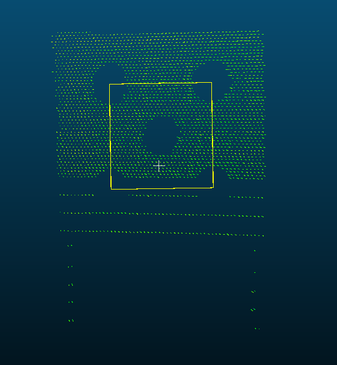

## Introduction

This is a project for factory calibration. Factory calibration is usually the last process in vehicle production. The calibration equipment is mainly composed of multiple calibration boards and four-wheel positioning. After the four-wheel positioning of the vehicle is finished, the calibration starts and the pose relationship between the sensors is calculated through the calibration board. We provide six types of calibration boards, the calibration board recognition program removes the Opencv dependency. The recognition performance is very high in different environments. 

## Prerequisites

- Cmake
- opencv 2.4
- eigen 3

## Compile

```shell
# mkdir build
mkdir -p build && cd build
# build
cmake .. && make
```

## Calibration board recognition

**chessboard:**

<left class="half">
&nbsp
</left>

**circle board:**

<left class="half">
&nbsp
</left>

**vertical board:**

<left class="half">
&nbsp
</left>

**apriltag board:**

<left class="half">
&nbsp
</left>

**Note:** Apriltag recognition code is derived from the open-source project [kalibr](https://github.com/ethz-asl/kalibr/tree/master/aslam_offline_calibration/ethz_apriltag2).

**aruco marker board:**

<left class="half">
&nbsp
</left>

**round hole board:**

<left class="half">
&nbsp
</left>

## Run
run command:
```shell
# run board detection
./bin/run_board_detect image board_type
# run round hole board detection
./bin/run_lidar_detect pcds
# run extrinsic calibration example
./bin/run_extrinsic_calib
# run camera homography matrix and vanishing point calibration example
./bin/run_homo_vp_calib image board_type output_dir
```