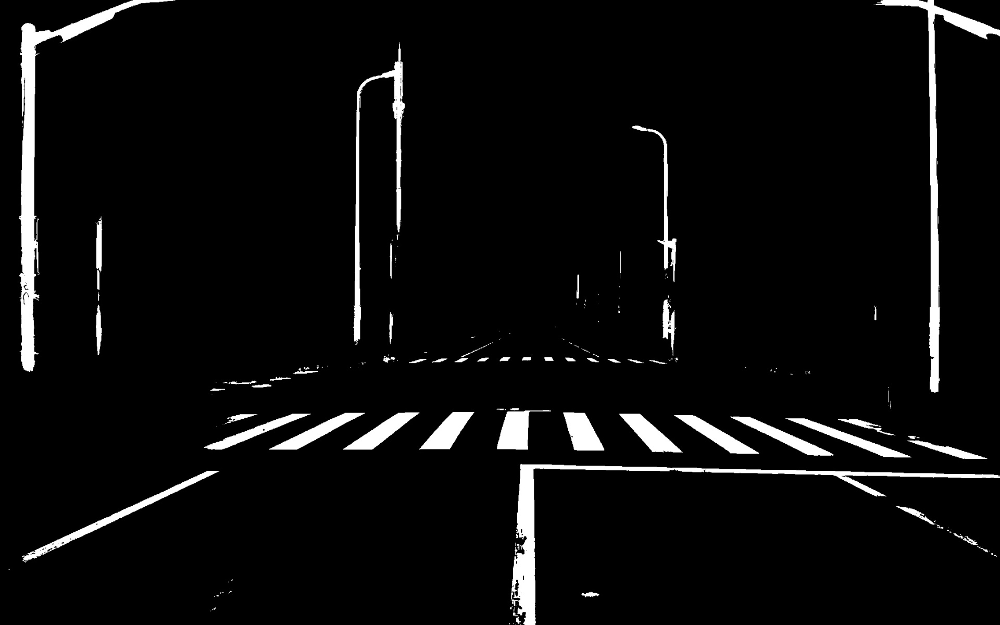

# Introduction

This automatic and user-friendly calibration tool is for calibrating the extrinsic parameter of LiDAR and camera in road scenes. Line  features  from  static  straight-line-shaped  objects  such  as  road lanes, lights, and telegraphy poles are extracted for both image and LiDAR point cloud, later on, calibration will be achieved by aligning those two kind of features. 

**Note:** To get line features for image like Figure below, pre-trained network for semantic segmentation can be downloaded from 

`wget http://download.tensorflow.org/models/deeplabv3_cityscapes_train_2018_02_06.tar.gz`

<br>

# Prerequisites

**C++ libraries for main calibration project **

- Cmake

- PCL1.7 
- Opencv 2.4.13
- PCL 1.9

**Python dependencies for image semantic segmentation**

* opencv
* tensorflow 1.15 (with CUDA 10.0 cudnn 7.6) `pip3 install tensorflow-gpu=1.15`
* [pydensecrf](https://github.com/lucasb-eyer/pydensecrf)  `pip3 install git+https://github.com/lucasb-eyer/pydensecrf.git`

# Usage

1. Five Input files: 

   `./lidar2camera mask_path pcd_path intrinsic_json extrinsic_json`

- **mask_path**: feature extracted image get by the pre-trained segmentation model
- **pcd_path**: PCD file from the Lidar sensor
- **intrinsic_json**: Camera intrinsic parameter JSON file
- **extrinsic_json**: JSON file of initial values of extrinsic parameters between sensors

2. Run the test sample:

   The executable file is under the bin folder.

   ```
   cd ~./auto_calib/lidar2camera
   ./bin/lidar2camera data/mask.jpg data/5.pcd data/center_camera-intrinsic.json data/top_center_lidar-to-center_camera-extrinsic.json
   ```

3. Calibration result:

   

