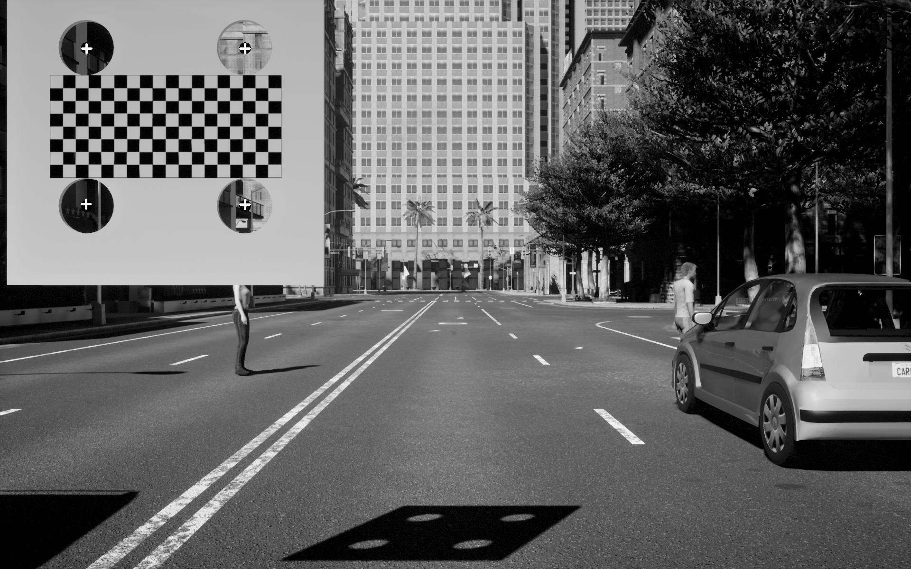
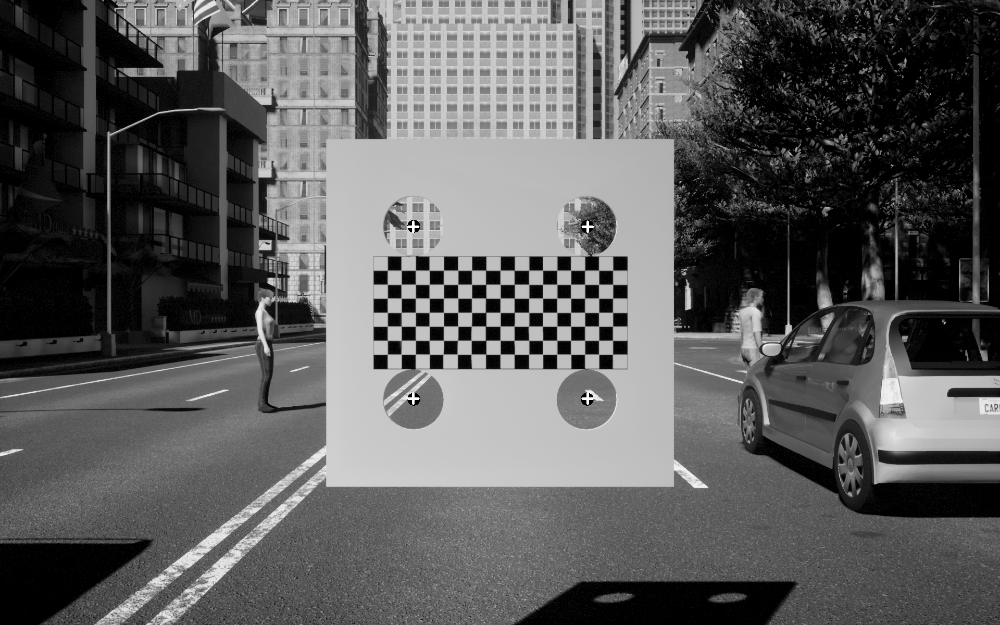
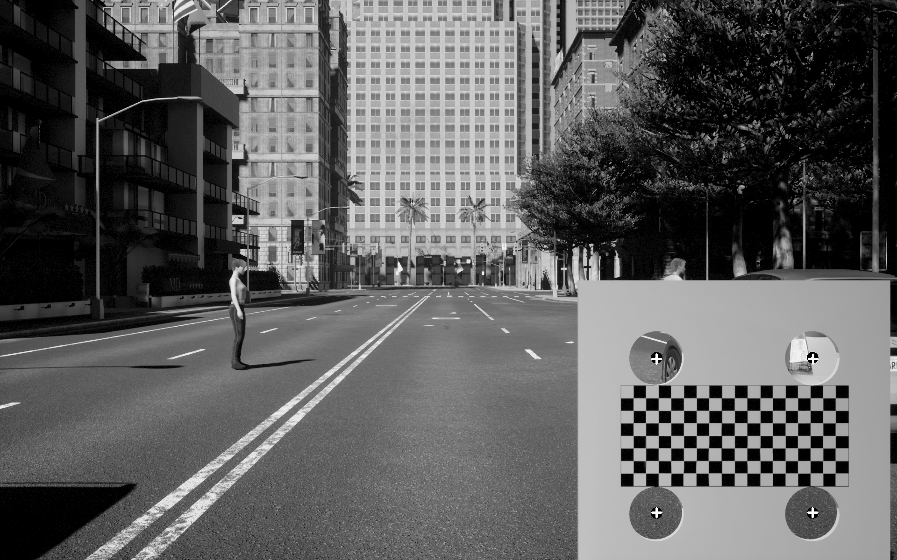

# Introduction

Joint Camera Intrinsic and LiDAR-Camera Extrinsic Calibration. 

## Prerequisites

- Cmake
- PCL1.7 
- Opencv 2.4.13
- PCL 1.9

## Compile
Compile in their respective folders

```shell
# mkdir build
mkdir -p build && cd build
# build
cmake .. && make
```


## Usage

1. Two Input files: 

   `./lidar2camera camera_dir csv_file`

- **camera_dir**: Collected camera calibration board data
- **csv_file**: The circles center points corresponding to the images

**Note:** To extract the circles center form PCD files, please refer to [README.md](tool/README.md).

2. Run the test sample:

   The executable file is under the bin folder.

   ```
   cd ~./lidar2camera/joint_calib
   ./bin/lidar2camera data/intrinsic/ data/circle.csv
   ```

3. Calibration result:

   
   
   
   

