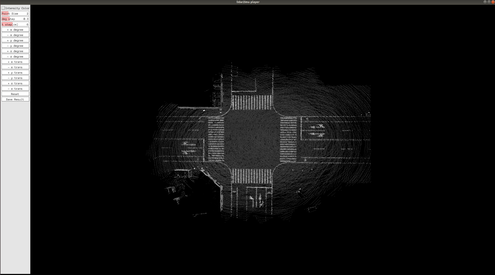
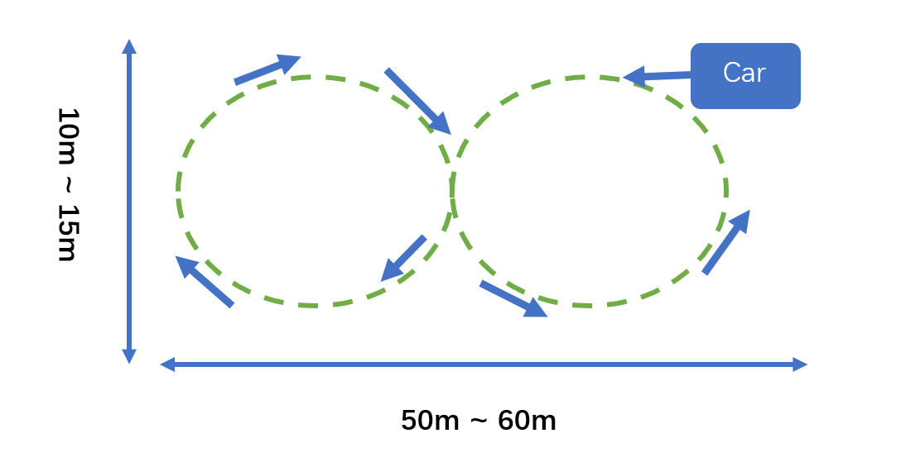
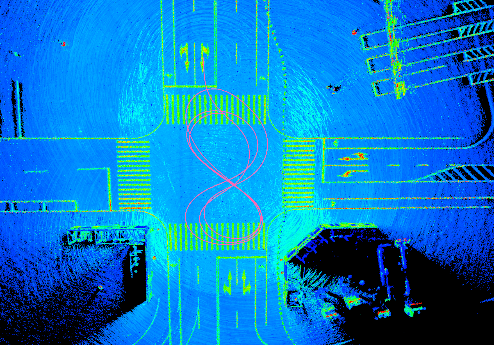
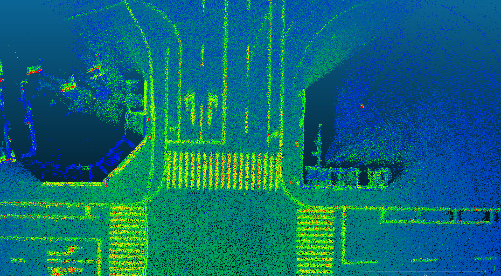
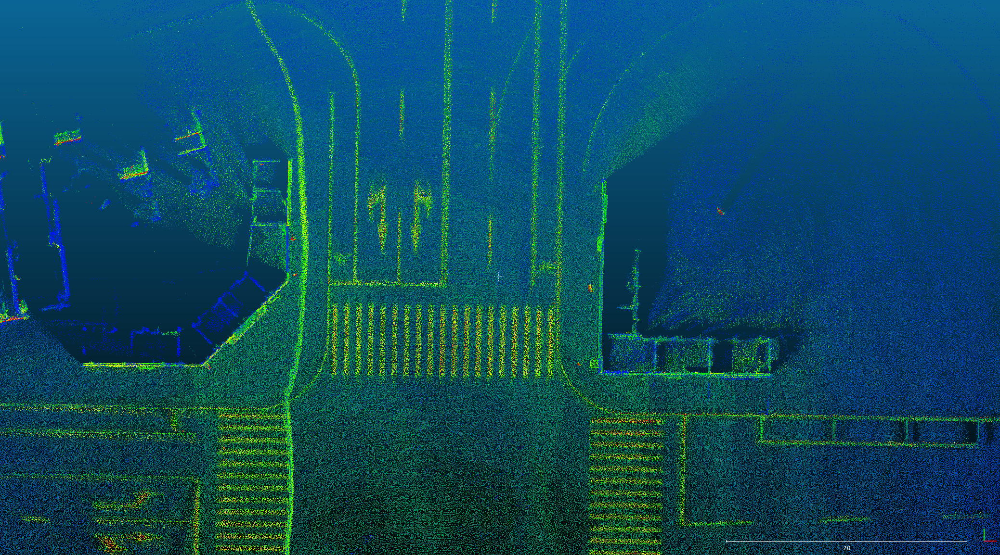
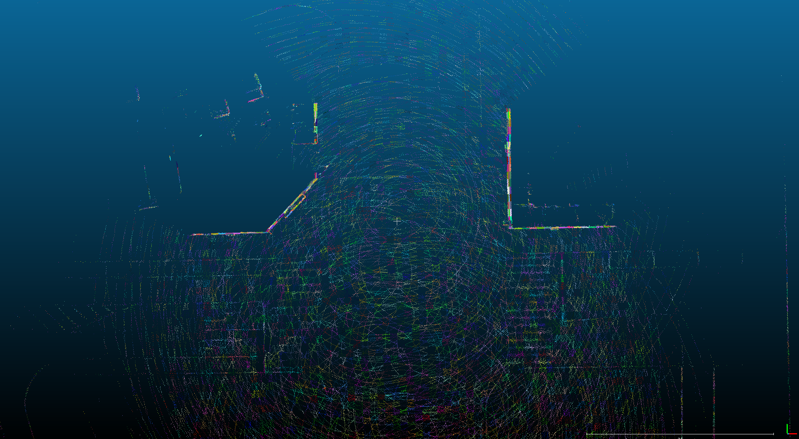
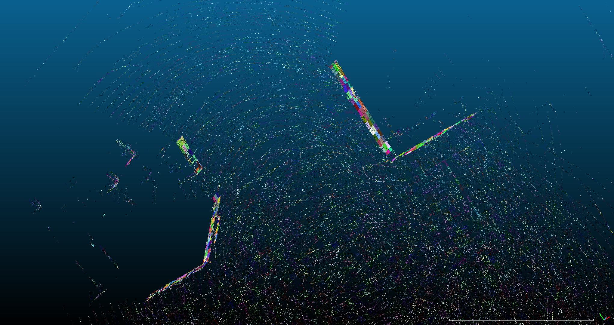

## Introduction

This is a project for LiDAR to IMU calibration， including automatic calibration and manual calibration.

## Prerequisites

- Cmake
- opencv 2.4
- eigen 3
- PCL 1.9
- Pangolin

## Compile
Compile in their respective folders

```shell
# mkdir build
mkdir -p build && cd build
# build
cmake .. && make
```

## Manual calibration tool

1. Four input files: 

   ```
   Usage: ./run_lidar2imu <lidar_pcds_dir> <lidar_pose_file> <extrinsic_json>
   ```
+ **lidar_pcds_dir:** LiDAR PCD data from the LiDAR sensor
+ **lidar_pose_file:** Poses file from the IMU sensor
+ **extrinsic_json:** JSON file of initial values of extrinsic parameters between sensors
</br>


2. Run the test sample:

   The executable file is under the bin folder.

   ```
   cd ~./manual_calib/
   ./bin/run_lidar2imu data/top_center_lidar data/top_center_lidar-pose.txt data/gnss-to-top_center_lidar-extrinsic.json
   ```
   **Note:** Because the data is relatively large, only part of the data is uploaded, the complete data can be downloaded from the link below.
   ```
   Link (链接): https://pan.baidu.com/s/1AODTuqhmgwbRWxGGCmo0iA 
   Extraction code (提取码): 94id
   ```

3. Calibration panel:

   <br>

   The calibration window consists of the left control panel for manual calibration and the right point cloud interface. Users can check whether the point cloud sequence is aligned by clicking the corresponding button in the panel or using Keyboard as input to adjust the extrinsic parameter. When the point cloud sequence is aligned, the calibration ends, click the save button to save the result.   

   | Extrinsic Params | Keyboard_input | Extrinsic Params | Keyboard_input |
   | :--------------: | :------------: | :--------------: | :------------: |
   |    +x degree     |       q        |    -x degree     |       a        |
   |    +y degree     |       w        |    -y degree     |       s        |
   |    +z degree     |       e        |    -z degree     |       d        |
   |     +x trans     |       r        |     -x trans     |       f        |
   |     +y trans     |       t        |     -y trans     |       g        |
   |     +z trans     |       y        |     -z trans     |       h        |

   ```Intensity Color```: LiDAR intensity is recorded as the return strength of a laser beam, partly based on the reflectivity of the object struck by the laser pulse. This button can change the display mode to intensity map display mode. This can help to check if the ground lane lines are aligned.

   ``deg step`` ``t step `` : These two buttons change the adjustment step for every click or keyboard input.

   ``point size``: Adjust the size of Lidar points in the projection image.

   ``Reset``:  Press button to reset all manual adjustment.

   ``Save Result``:  If the this button was pressed, the results are stored by default at running directory `~./manual_calib/`:

   ```
   Extrinsic:
   R:
   0.0121008 -0.999863 -0.0112902
   0.0133341 0.0114512 -0.999846
   0.999838 0.0119484 0.0134707
   t: 0.0134153 -0.352602 -0.575013
   
   ************* json format *************
   Extrinsic:
   [0.0121008,-0.999863,-0.0112902,0.0134153],[0.0133341,0.0114512,-0.999846,-0.352602],[0.999838,0.0119484,0.0134707,-0.575013],[0,0,0,1]

   ```

## Automatic calibration tool

This automatic and user-friendly calibration tool is for calibrating the extrinsic parameter of LiDAR and IMU in road scenes.
## Calibration data collection

According to the figure below for data collection, the calibration vehicle records IMU and LiDAR data.

1. Ensure that the ground is sufficiently flat
2. Ensure that there are enough features around, such as walls, lane lines, poles, stationary vehicles, etc.
3. The calibrated vehicle circulates three times according to the trajectory shown in the figure below, and the vehicle speed is maintained at 10km/h.
4. Try not to have dynamic objects around, such as vehicles, etc.

<br>

## Usage

2. Run the test sample:

   The executable file is under the bin folder.

   ```
   cd ~./auto_calib/
   ./bin/run_lidar2imu data/top_center_lidar/ data/NovAtel-pose-lidar-time.txt data/gnss-to-top_center_lidar-extrinsic.json
   ```
   **Note:** Because the data is relatively large, only part of the data is uploaded, the complete data can be downloaded from the link below.
   ```
   Link (链接): https://pan.baidu.com/s/1AODTuqhmgwbRWxGGCmo0iA 
   Extraction code (提取码): 94id
   ```

3. Calibration result:

    <br>
   
   comparison before and after calibration:<br>
   before calibration
   <br>
   after calibration<br>
   <br>

   point cloud feature map:<br>
   <br><br>
   <br><br>
   <br><br>

