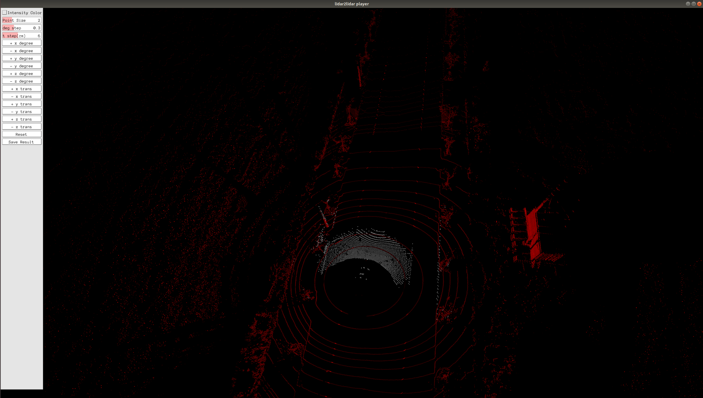

## Introduction

This is a project for LiDAR to LiDAR calibration， including automatic calibration and manual calibration.

## Prerequisites

- Cmake
- opencv 2.4
- eigen 3
- PCL 1.9
- Pangolin

## Compile
Compile in their respective folders

```shell
# mkdir build
mkdir -p build && cd build
# build
cmake .. && make
```

## Manual calibration tool

1. Four input files: 

   ```
   Usage: ./run_lidar2lidar <target_pcd_path> <source_pcd_path> <extrinsic_json>
   ```
+ **target_pcd_path:** PCD file from the Lidar sensor
+ **source_pcd_path:** PCD file from the Lidar sensor
+ **extrinsic_json:** JSON file of initial values of extrinsic parameters between sensors
</br>


2. Run the test sample:

   The executable file is under the bin folder.

   ```
   cd ~./manual_calib/
   ./bin/run_lidar2lidar data/qt.pcd data/p64.pcd data/p64-to-qt-extrinsic.json
   ```

3. Calibration panel:

   <br>

   The calibration window consists of the left control panel for manual calibration and the right point cloud interface. Users can check whether the two point clouds are aligned by clicking the corresponding button in the panel or using Keyboard as input to adjust the extrinsic parameter. When the two point clouds are aligned, the calibration ends, click the save button to save the result.  

   | Extrinsic Params | Keyboard_input | Extrinsic Params | Keyboard_input |
   | :--------------: | :------------: | :--------------: | :------------: |
   |    +x degree     |       q        |    -x degree     |       a        |
   |    +y degree     |       w        |    -y degree     |       s        |
   |    +z degree     |       e        |    -z degree     |       d        |
   |     +x trans     |       r        |     -x trans     |       f        |
   |     +y trans     |       t        |     -y trans     |       g        |
   |     +z trans     |       y        |     -z trans     |       h        |

   ```Intensity Color```: LiDAR intensity is recorded as the return strength of a laser beam, partly based on the reflectivity of the object struck by the laser pulse. This button can change the display mode to intensity map display mode. This can help to check if the ground lane lines are aligned.

   ``deg step`` ``t step `` : These two buttons change the adjustment step for every click or keyboard input.

   ``point size``: Adjust the size of Lidar points in the projection image.

   ``Reset``:  Press button to reset all manual adjustment.

   ``Save Result``:  If the this button was pressed, the results are stored by default at running directory `~./manual_calib/`:

   ```
   Extrinsic:
   R:
   0.0121008 -0.999863 -0.0112902
   0.0133341 0.0114512 -0.999846
   0.999838 0.0119484 0.0134707
   t: 0.0134153 -0.352602 -0.575013
   
   ************* json format *************
   Extrinsic:
   [0.0121008,-0.999863,-0.0112902,0.0134153],[0.0133341,0.0114512,-0.999846,-0.352602],[0.999838,0.0119484,0.0134707,-0.575013],[0,0,0,1]

   ```

## Automatic calibration tool

This automatic and user-friendly calibration tool is for calibrating the extrinsic parameter of LiDAR and LiDAR in road scenes.
## Calibration data collection

According to the figure below for data collection, the calibration vehicle records LiDARs data.

1. Ensure that the ground is sufficiently flat
2. Ensure that there are enough features around, such as walls, lane lines, poles, stationary vehicles, etc.
3. Try not to have dynamic objects around, such as vehicles, etc.

## Usage

## Usage

1. Two input files: 

   `point_cloud_path initial_extrinsic`

- **point_cloud_path**: paths of Lidar point clouds
- **initial_extrinsic**: initial extrinsic parameters

2. Run the test sample:

   The executable file is under the bin folder.

   ```
   ./bin/run_lidar2lidar data/0001/lidar_cloud_path.txt data/0001/initial_extrinsic.txt
   ```

## Citation
This code is based on the research below:
```
@misc{2203.03182,
Author = {Pengjin Wei and Guohang Yan and Yikang Li and Kun Fang and Wei Liu and Xinyu Cai and Jie Yang},
Title = {CROON: Automatic Multi-LiDAR Calibration and Refinement Method in Road Scene},
Year = {2022},
Eprint = {arXiv:2203.03182},
}
   
```
