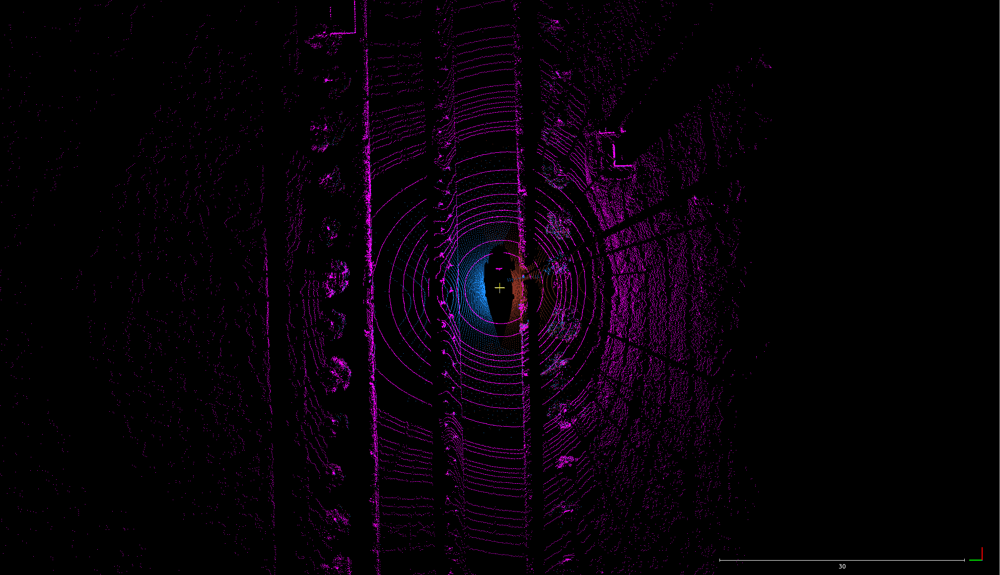
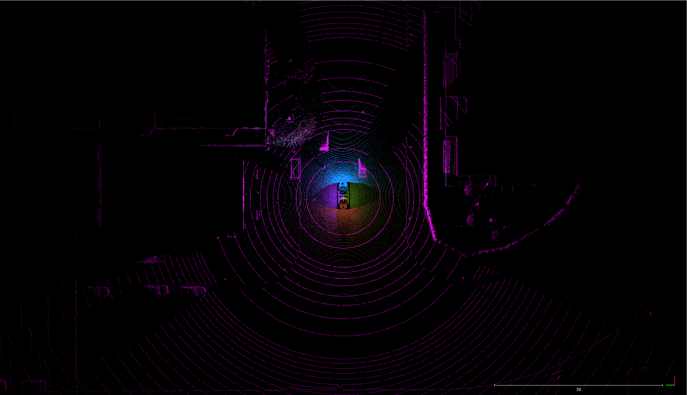

# LiDAR2LiDAR
# CROON: Automatic Multi-LiDAR Calibration and Refinement Method in Road Scene
For more calibration codes, please refer to the link <a href="https://github.com/PJLab-ADG/SensorsCalibration" title="SensorsCalibration">SensorsCalibration</a>


## Prerequisites

- Cmake
- Opencv 2.4.13
- PCL 1.9

## Compile
Compile in their respective folders

```shell
# mkdir build
mkdir -p build && cd build
# build
cmake .. && make
```

## Dataset
Because the dataset is relatively large, only test samples are uploaded, the complete data can be download from the link below.
```
Link(链接): https://pan.baidu.com/s/1EhiNVWAD1t96h0to7GTlIA
Extration code(提取码): ctuk
```

## Usage

1. Three input files: 

   `point_cloud_path initial_extrinsic output_dir`

- **point_cloud_path**: paths of Lidar point clouds
- **initial_extrinsic**: initial extrinsic parameters
- **output_dir**: output path


2. Run the test sample:

   The executable file is under the bin folder.

   ```
   cd ./lidar2lidar/auto_calib/
   ./bin/run_lidar2lidar  ./test_samples/real_world/2022-02-15-17-31-37-050/lidar_cloud_path.txt   ./test_samples/real_world/2022-02-15-17-31-37-050/initial_extrinsic.txt  outputs/2022-02-15-17-31-37-050
   ./bin/run_lidar2lidar  ./test_samples/real_world/2022-02-15-17-36-04-449/lidar_cloud_path.txt   ./test_samples/real_world/2022-02-15-17-36-04-449/initial_extrinsic.txt  outputs/2022-02-15-17-36-04-449
   ./bin/run_lidar2lidar  ./test_samples/real_world/2022-02-15-17-45-07-750/lidar_cloud_path.txt   ./test_samples/real_world/2022-02-15-17-45-07-750/initial_extrinsic.txt  outputs/2022-02-15-17-45-07-750
   ./bin/run_lidar2lidar  ./test_samples/carla_data/004069/lidar_cloud_path.txt   ./test_samples/carla_data/004069/initial_extrinsic.txt  outputs/004069
   ./bin/run_lidar2lidar  ./test_samples/carla_data/004553/lidar_cloud_path.txt   ./test_samples/carla_data/004553/initial_extrinsic.txt  outputs/004553
   ./bin/run_lidar2lidar  ./test_samples/carla_data/005466/lidar_cloud_path.txt   ./test_samples/carla_data/005466/initial_extrinsic.txt  outputs/005466
   ```

3. Calibration result:

   
   
   
   
   
   

## Citation
This code is based on the research below:
```
@misc{2203.03182,
Author = {Pengjin Wei and Guohang Yan and Yikang Li and Kun Fang and Wei Liu and Xinyu Cai and Jie Yang},
Title = {CROON: Automatic Multi-LiDAR Calibration and Refinement Method in Road Scene},
Year = {2022},
Eprint = {arXiv:2203.03182},
}
   
```
