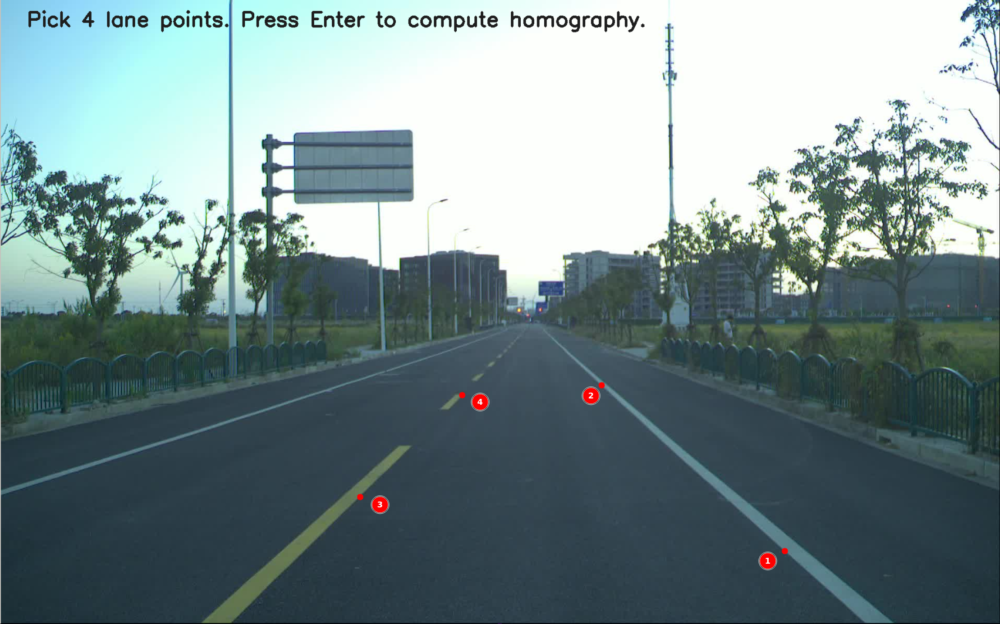
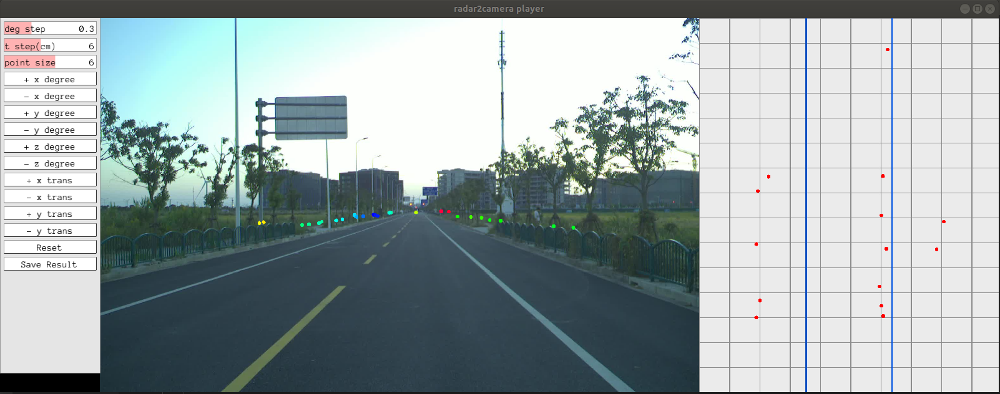

## Introduction

This is a project for Radar to camera calibration， currently only including manual calibration.

## Prerequisites

- Cmake
- opencv 2.4
- eigen 3
- PCL 1.9
- Pangolin

## Compile
Compile in their respective folders

```shell
# mkdir build
mkdir -p build && cd build
# build
cmake .. && make
```

## Manual calibration tool

1. Four input files: 

   ```
   Usage: ./run_radar2camera <image_path> <radar_file_path> <intrinsic_json> <homo_json> <extrinsic_json>
   ```
+ **image_path:** image file from the Camera sensor
+ **radar_file_path:** CSV file from the Radar sensor
+ **intrinsic_json:** Camera intrinsic parameter JSON file
+ **homo_json:** Camera-to-ground homography matrix JSON file
+ **extrinsic_json:** JSON file of initial values of extrinsic parameters between sensors
</br>


2. Run the test sample:

   The executable file is under the bin folder.

   ```
   cd ~./manual_calib/
   ./bin/run_radar2camera data/0.jpg data/front_radar.csv data/center_camera-intrinsic.json data/center_camera-homography.json data/radar-to-center_camera-extrinsic.json
   ```
   In the figure below, select two lane lines as follows to form a set of parallel lines
   <br>
   Turn the lane line of the image to the bird's-eye view through the homography matrix, as shown in the right part of the calibration panel below. At the end of calibration, ensure that the Radar points along the road are parallel to the lane line.

   <br>
3. Calibration panel:

   <br>

   The calibration window consists of the left control panel for manual calibration and the right point cloud projection image. Users can check whether the points cloud and the image are aligned by clicking the corresponding button in the panel or using Keyboard as input to adjust the extrinsic parameter. When the points cloud and the image are aligned, the calibration ends, click the save button to save the result.  

   | Extrinsic Params | Keyboard_input | Extrinsic Params | Keyboard_input |
   | :--------------: | :------------: | :--------------: | :------------: |
   |    +x degree     |       q        |    -x degree     |       a        |
   |    +y degree     |       w        |    -y degree     |       s        |
   |    +z degree     |       e        |    -z degree     |       d        |
   |     +x trans     |       r        |     -x trans     |       f        |
   |     +y trans     |       t        |     -y trans     |       g        |
   |     +z trans     |       y        |     -z trans     |       h        |

   ``deg step`` ``t step `` : These two buttons change the adjustment step for every click or keyboard input.

   ``point size``: Adjust the size of Lidar points in the projection image.

   ``Reset``:  Press button to reset all manual adjustment.

   ``Save Result``:  If the this button was pressed, the results are stored by default at running directory `~./manual_calib/`:

   ```
   Extrinsic:
   R:
   0.0121008 -0.999863 -0.0112902
   0.0133341 0.0114512 -0.999846
   0.999838 0.0119484 0.0134707
   t: 0.0134153 -0.352602 -0.575013
   
   ************* json format *************
   Extrinsic:
   [0.0121008,-0.999863,-0.0112902,0.0134153],[0.0133341,0.0114512,-0.999846,-0.352602],[0.999838,0.0119484,0.0134707,-0.575013],[0,0,0,1]

   ```