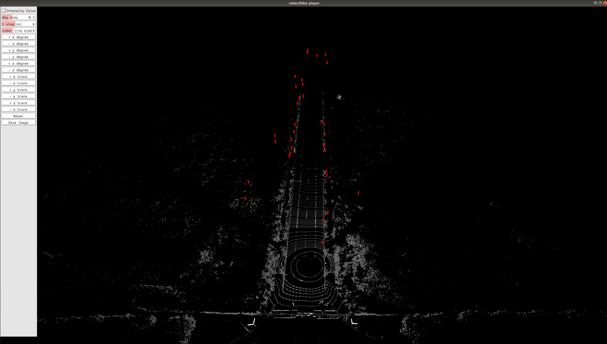

## Introduction

This is a project for Radar to LiDAR calibration， currently only including manual calibration.

## Prerequisites

- Cmake
- opencv 2.4
- eigen 3
- PCL 1.9
- Pangolin

## Compile
Compile in their respective folders

```shell
# mkdir build
mkdir -p build && cd build
# build
cmake .. && make
```

## Manual calibration tool

1. Four input files: 

   ```
   Usage: ./run_radar2lidar <pcd_path> <radar_file_path> <extrinsic_json>
   ```
+ **pcd_path:** PCD file from the Lidar sensor
+ **radar_file_path:** CSV file from the Radar sensor
+ **extrinsic_json:** JSON file of initial values of extrinsic parameters between sensors
</br>


2. Run the test sample:

   The executable file is under the bin folder.

   ```
   cd ~./manual_calib/
   ./bin/run_radar2lidar data/lidar.pcd data/front_radar.csv data/front_radar-to-top_center_lidar-extrinsic.json
   ```

3. Calibration panel:

   <br>

   The calibration window consists of the left control panel for manual calibration and the right point cloud interface. Users can check whether the Radar point cloud and LiDAR point cloud are aligned by clicking the corresponding button in the panel or using Keyboard as input to adjust the extrinsic parameter. When the Radar point cloud and LiDAR point cloud are aligned, the calibration ends, click the save button to save the result.  

   | Extrinsic Params | Keyboard_input | Extrinsic Params | Keyboard_input |
   | :--------------: | :------------: | :--------------: | :------------: |
   |    +x degree     |       q        |    -x degree     |       a        |
   |    +y degree     |       w        |    -y degree     |       s        |
   |    +z degree     |       e        |    -z degree     |       d        |
   |     +x trans     |       r        |     -x trans     |       f        |
   |     +y trans     |       t        |     -y trans     |       g        |
   |     +z trans     |       y        |     -z trans     |       h        |

   ```Intensity Color```: LiDAR intensity is recorded as the return strength of a laser beam, partly based on the reflectivity of the object struck by the laser pulse. This button can change the display mode to intensity map display mode. This can help to check if the ground lane lines are aligned.

   ``deg step`` ``t step `` : These two buttons change the adjustment step for every click or keyboard input.

   ``point size``: Adjust the size of Lidar points in the projection image.

   ``Reset``:  Press button to reset all manual adjustment.

   ``Save Result``:  If the this button was pressed, the results are stored by default at running directory `~./manual_calib/`:

   ```
   Extrinsic:
   R:
   0.0121008 -0.999863 -0.0112902
   0.0133341 0.0114512 -0.999846
   0.999838 0.0119484 0.0134707
   t: 0.0134153 -0.352602 -0.575013
   
   ************* json format *************
   Extrinsic:
   [0.0121008,-0.999863,-0.0112902,0.0134153],[0.0133341,0.0114512,-0.999846,-0.352602],[0.999838,0.0119484,0.0134707,-0.575013],[0,0,0,1]

   ```