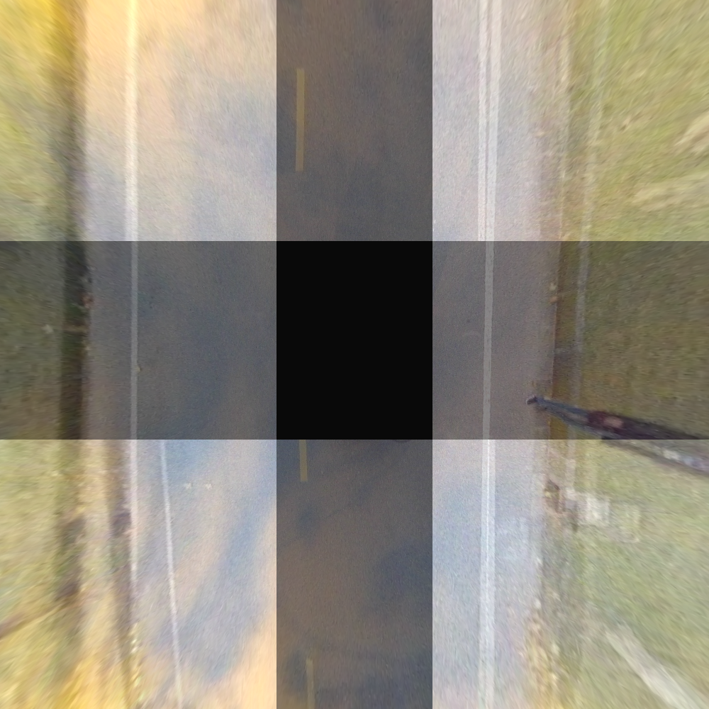
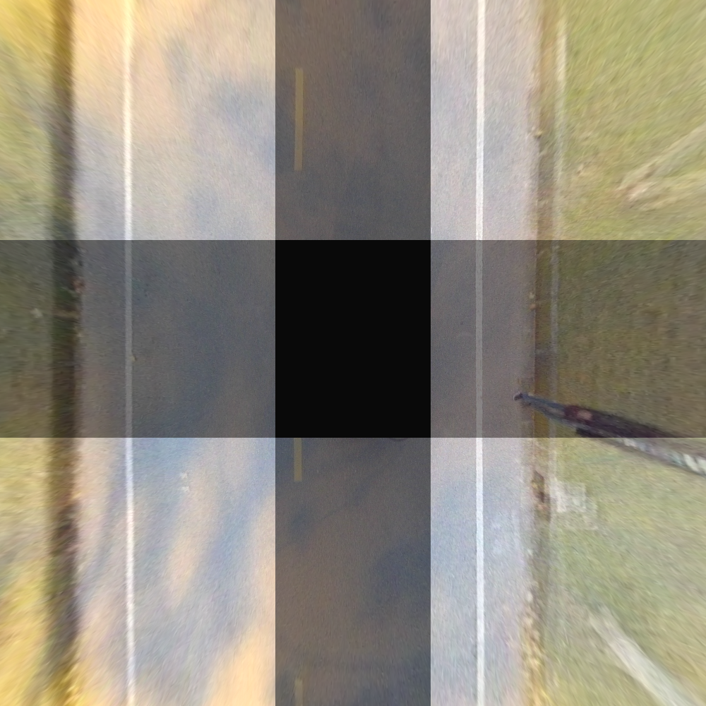

# auto_calib_fisheye
This is an auto-calibration tool based on surround-view fisheye cameras.

## Compile
```shell
# mkdir build
mkdir -p build && cd build
# build
cmake .. && make
```
## Run the test sample:
The executable file is under the bin folder.
```
cd ~./auto_calib/
./bin/run_AVM_Calibration
```
Before calibration
 
After calibration
 

